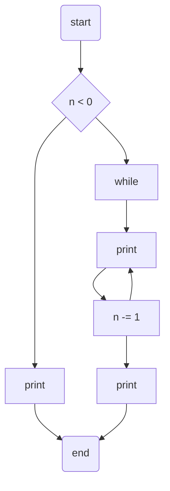

# ソフトウェア工学 演習 課題2,3,4 回答

## 課題2

図にモデル図に表すと以下のようになる(mermaid記法でグラフ化される)

これをもとに頂点と辺と連結成分の数を数えると以下のようになる。

- `# of node`: 7
- `# of edges`: 8
- `# of connected components`: 1

これより、MCCを計算すると、
`cyclomatic complexity`
= 8 - 7 + 2 * 1
= 3

### 課題2 回答

MCCは 3 である。

## 課題3

クラスToyは、クラスPとQとRを利用している。 → 3

クラスPは、クラスWを利用している。 → 1

クラスQは、クラスVを利用している。 → 1

クラスRは、どのクラスも利用していない。 → 0

クラスVは、クラスQを利用している。 → 1

クラスWは、クラスRを利用している。

クラスQにとってのCBO，クラスRにとってのCBO，クラスVにとってのCBO，クラスWにとってのCBO

### 課題3 回答

クラスPにとってのCBO = 3
クラスQにとってのCBO = 1
クラスRにとってのCBO = 0
クラスVにとってのCBO = 1
クラスWにとってのCBO = 1

## 課題4

- m → 9
- a → 5
- m_{__n} → 2
- m_{__n1} → 6
- m_{__buf} → 4
- m_{__hd} → 7
- m_{__tl} → 7

LCOM3 → (9 - (2+6+4+7+7)/5)/(9 - 1) = 0.475

### 課題4 回答

クラスRingBufferのLCOM3は 0.475 である。